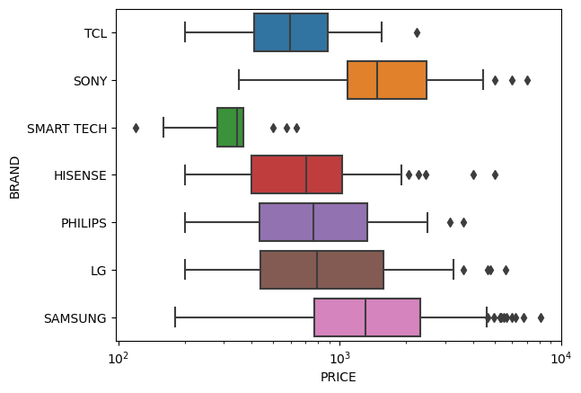

# Uncovering TV Prices: A Data Scraping Endeavor

The project "Uncovering TV Prices: A Data Scraping Endeavor" aims to gain deeper insights into the market positioning and strategies of TV manufacturers by analyzing a comprehensive dataset of TV prices and specifications. All the details can be found in the Jupyter Notebook **TV Scraping.ipynb**.

The objectives include market segmentation, competitive analysis, brand perception, feature preference analysis, and providing strategic recommendations for manufacturers. The data scraping process involves extracting insights from Worten's e-commerce platform, a prominent Portuguese technology retailer offering 542 televisions for analysis. 

Through this project, valuable insights into consumer demographics, market trends, and competitive advantages are expected to be revealed. Below is showcased one of the many diagrams studied in this project.



The Python libraries leveraged in this project included:

```python
import requests
from bs4 import BeautifulSoup
import logging
import pandas as pd
import numpy as np
import matplotlib.pyplot as plt
import seaborn as sns
```
